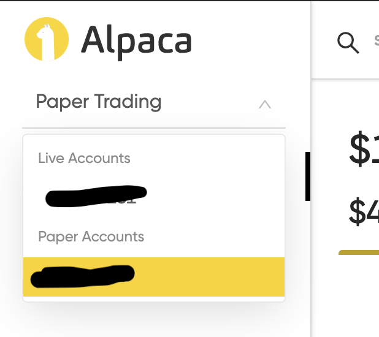
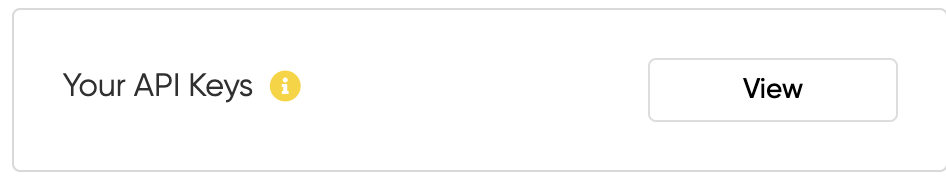

# Alpaca Stock Trading Serverless App

## Prerequisites
* Terraform installed
* Serverless Framework installed
* Personal AWS account created

## Setup
1. Create an AWS credentials profile with programmatic access named "alpaca"

       $ aws configure --profile alpaca

1. Create an S3 bucket in the us-east-1 region for your terraform state. Once done, update the configuration: 

        ./terraform/env/dev/main.tf

        bucket  = "alpaca-terraform" (change to your bucket name)

1. Create an Alpaca Market account (https://alpaca.markets/). You do not need to add money to your live account to test out this API. Make sure you are using API keys under the "Paper" account for testing. "Paper" is the name of the Alpaca testing environment that allows for you to use fake money against the live market for simulation. (Just don't put money in the live one until you're ready and there's nothing to worry about)

1. Create a new AWS Secrets Manager record with the following name and value. The beginning "dev" is important for the specific serverless stage that you ar deploying. If you create a "prod" stage later then you'd create another record with name "prod/alpaca". 

        name: dev/alpaca

        {
            "keyId": "YOUR_PAPER_API_KY",
            "secretKey": "YOUR_PAPER_SECRET_KEY",
            "paper": "true",
            "usePolygon": "false"
        }

## Deploy
Run the following command inside the project directory: 

        $ cd serverless && npm run deploy

You will be asked to continue with the terraform apply, enter 'yes'.

This will deploy using the ./scripts/deploy.sh

        #!/bin/bash

        echo "Running terraform init"
        (cd ../terraform/env/dev && terraform init)
        wait
        echo "Completed terraform init"
        
        echo "Running terraform apply"
        (cd ../terraform/env/dev && terraform apply)
        wait
        echo "Completed terraform apply"
        
        echo "Running npm install"
        (cd ../serverless  && npm install)
        wait
        echo "Completed npm install"

        echo "Running sls deploy"
        (cd ../serverless && sls deploy)
        wait
        echo "Completed sls deploy"

        echo "Done"

* Will want to pass in the environment/stage as a param for the script at some point

## Destroy
Run the following command to teardown everything, you should do this when not developing to reduce costs of the NAT gateway ($0.04 / hour = $35 / month if you leave it up).

        $ cd serverless && npm run destroy

You will be asked to continue with the terraform destroy, enter 'yes'.

This will destroy using the ./scripts/destroy.sh

        #!/bin/bash

        echo "Running sls remove"
        (cd ../serverless && sls remove)
        wait
        echo "Completed sls remove"
        echo "Running terraform destroy"
        (cd ../terraform/env/dev && terraform destroy)
        echo "Completed terraform destroy"
        echo "Done"

* Will want to pass in the environment/stage as a param for the script at some point